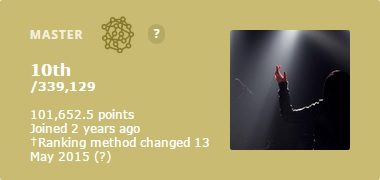
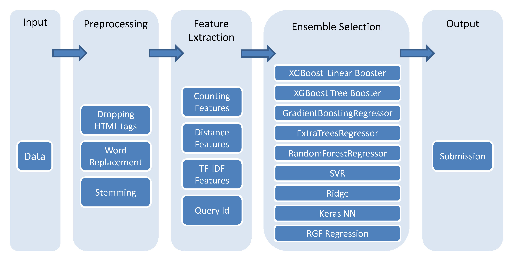
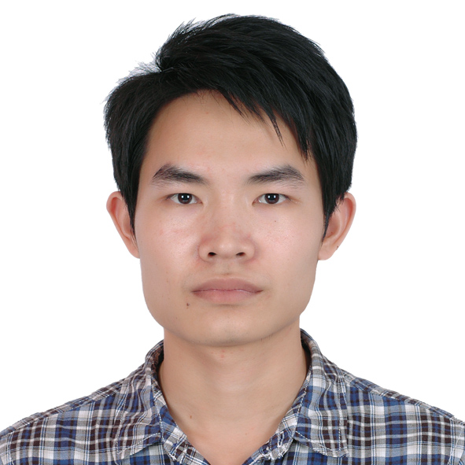

# Search Results Relevance Winner's Interview: 1st place, Chenglong Chen

# Personal details

* Name: Chenglong Chen
* Location: Guangzhou, Guangdong, China
* Email: c.chenglong@gmail.com
* Competition: Search Results Relevance

# The Basics

## What was your background prior to entering this challenge?

I was a Ph.D. student in Sun Yat-sen University, Guangzhou, China, and my research mainly focused on passive digital image forensics. I have applied various machine learning methods, e.g., SVM and deep learning, to detect whether a digital image has been edited/doctored, or how much has the image under investigation been resized/rotated.

*Chenglong's [profile](https://www.kaggle.com/chenglongchen) on Kaggle*

I am very interested in machine learning and have read quite some related papers. I also love to compete on Kaggle to test out what I have learnt and also to improve my coding skill. Kaggle is a great place to data scientists, and it offers real world problems and data in various domains.

## Do you have any prior experience or domain knowledge that helped you succeed in this competition?

I have a background of image proecssing and have limited knowledge about NLP except BOW/TF-IDF kinda of things. During the competition, I frequently refered to the book *Python Text Processing with NLTK 2.0 Cookbook* or Google for how to clean text or create features from text.

I did have read the paper about ensemble selection (which is the ensembling method I used in this competition) a long time ago, but I haven't have the opportunity to try it out myself in real word problem. I previously only tried simple (weighted) averaging or majority voting. This is the first time I got so serious about the model ensembling part.

## How did you get started competing on Kaggle?

It dates back a year and a half ago. At that time, I was taking Prof. Hsuan-Tien Lin's Machine Learning Foundations course on Coursera. He encouraged us to compete on Kaggle to apply what we have learnt to real world problems. From then on, I have ocassionally participated in competitions I found interested. And to be honest, most of my programming skills about Python and R are learnt during Kaggling.

## What made you decide to enter this competition?

After I passed my Ph.D. disseration denfend early in May, I have some spare time before starting my job in an Internet company. I decided that I should learn something new and mostly get prepared for my job. Since my job will be about advertisting and mostly NLP related, I thought this challenge would be a great opportunity to familiarize myself with some basic or advanced NLP concepts. This is the main reason that drove me to enter.

Another reason was that this dataset is not very large, which is ideal for practicing ensemble skills. While I have read papers about ensembling methods, I haven't got very serious about ensmbling in previous competitions. Usually, I would try very simple (weighted) averaging. I thought this is a good chance to try some of the methods I have read, e.g., stacking generalization and ensemble selection.

# Let's get technical

## What preprocessing and supervised learning methods did you use?

The documentation and code for my approach are available [here](https://github.com/ChenglongChen/Kaggle_CrowdFlower). Below is a high level overview of my method.

*Figure 1. The flowchart of my method.*

For preprocessing, I mainly performed HTML tags dropping, word replacement, and stemming. For supervised learning method, I used ensemble selection to generate ensemble from a model library. The model library was built with models trained using various algorithms, various parameter settings, and various feature sets. I have used [Hyperopt](http://hyperopt.github.io/hyperopt/) (usually used in parameter tuning) to choose parameter setting from a pre-defined parameter space for training different models.

I have tried various objectives, e.g., MSE, softmax, and pairwise ranking. MSE turned out to be the best with appropriate decoding method. The following is the decoding method I used for MSE (i.e., regression)

1. calculate the pdf/cdf of each median relevance level, 1 is about 7.6%, 1 + 2 is
about 22%, 1 + 2 + 3 is about 40%, and 1 + 2 + 3 + 4 is 100%.
2. rank the raw prediction in an ascending order.
3. set the first 7.6% to 1, 7.6% - 22% to 2, 22% - 40% to 3, and the rest to 4.

In CV, the pdf/cdf is calculated using training fold only, and in final model training,
it is computed using the whole training data.

Figure 2 shows some histograms from my reproduced best single model for one run of CV (only one validation fold is used). In specific, I plot histograms of 1) raw prediction, 2) rounding decoding, 3) ceiling decoding, and 4) the above cdf decoding, grouped by the true relevance. It's most obvious that both rounding and ceiling decoding methods have difficulty in predicting relevance 4.

*Figure 2. Histograms of raw prediction and predictions using various decoding methods grouped by true relevance. (The code generated this figure is available [here](https://github.com/ChenglongChen/Kaggle_CrowdFlower/blob/master/Fig/compare_MSE_decoding.py).)*

Following are the kappa scores for each decoding method (using all 3 runs and 3 folds CV). The above cdf decoding method exhibits the best performance among the three methods we considered.

| Method   | CV Mean  | CV Std   |
| :------: | :------: | :------: |
| Rounding | 0.404277 | 0.005069 |
| Ceiling  | 0.513138 | 0.006485 |
| CDF      | 0.681876 | 0.005259 |

## What was your most important insight into the data?

I have found that the most important features for predicting the search results relevance is the *correlation* or *distance* between query and product title/description. In my solution, I have features like interset word counting features, Jaccard coefficients, Dice distance, and cooccurencen word TF-IDF features, etc. Also, it¡¯s important to perform some word replacements/alignments, e.g., spelling correction and synonym replacement, to align those words with the same or similar meaning.

While I didn't have much time exploring word embedding methods, they are very promissing for this problem. During the competition, I have come across a paper entitled "*From word embeddings to document distances*." The authors of this paper used Word Mover¡¯s Distance (WMD) metric together with word2vec embeddings to measure the distance between text documents. This metric is shown to have superior performance than BOW and TF-IDF features.

## Were you surprised by any of your findings?

I have tried optimizing kappa directly uisng XGBoost (see below), but it performed a bit worse than plain regression. This might have something to do with the hessian, which I couldn't get to work unless I used some scaling and change it to its absolute value (see [here](https://github.com/ChenglongChen/Kaggle_CrowdFlower/blob/master/Code/Model/utils.py#L247-L252)).

## Which tools did you use?

I used Python for this competition. For feature engineering part, I heavily relied on pandas and Numpy for data manipulation, TfidfVectorizer and SVD in Sklearn for extracting text features. For model training part, I mostly used [XGBoost](https://github.com/dmlc/XGBoost/releases/tag/v0.40), [Sklearn](http://scikit-learn.org/stable/), [keras](https://github.com/fchollet/keras/releases/tag/0.1.1) and [rgf](http://stat.rutgers.edu/home/tzhang/software/rgf/).

I would like to say a few more words about XGBoost, which I have been used very often. It is great, accurate, fast and easy of use. Most importantly, it supports customized objective. To use this functionality, you have to provide the gradient and hessian of your objective. This is quite helpful in my case. During the competition, I have tried to optimize quadratic weighted kappa directly using XGBoost. Also, I have implemented two ordinal regression algorithms within XGBoost framework (both by specifying the cutomized objective.) These models contribute to the final winning submission too.

## How did you spend your time on this competition?

The time I have spent on the competition changed during the competition.

1. In the early stage, I mostly focused on data preprocessing. I have spent quite amount of time on researching and coding down the methods to perform text cleaning. I have to mention that quite some efforts were spent on exploring the data (e.g., figuring out misspellings and synonyms etc.)

2. Then, I have spent most of my time on feature extraction and try to figure out what features will be useful for this task. The time was split pretty equally between researching and coding.

3. In the same period, I have decided to build model using ensemble selection and realized my implementation was not flexible enough to that goal. So, I have spent most of the time refactoring my implementation.

4. After that, most of the time has been spending on coding down the training and prediction parts of various models. I didn't spend much time on tuning each model's performance. I utilized Hyperopt for parameter tuning and model library building.

5. With the pipeline for ensemble selection being built, most of my time was spent on figuring out new features and exploring the provided data.

In short, I would say I have done a lot of researching and coding during this competition.

## What was the run time for both training and prediction of your winning solution?

Since the dataset is kinda of small size and kappa is not very stable, I utilized bagged ensemble selection from a model library containing hundreds or thoudsands of models to combat overfitting and stabalize my results. I don't have an exact number of the hours or days, but it should take quite amount of time to train and make prediction. Furthermore, this also depends on the trade-off between the size of the model library (computation burden) and the perforamnce. 

That being said, you should be able to train the best single model (i.e., XGBoost with linear booster) in a few hours. It will give you a model of kappa score about **0.708** (Private LB), which should be enough for a top **15** place. For this model, feature extraction occupied most of the time. The training part (using the best parameters I have found) should be a few minutes using multi-threads (e.g., 8).

# Words of wisdom

## What have you taken away from this competition?

* Ensembling of a bunch of diverse models helps a lot. Figure 3 shows the CV mean, Public LB, and Private LB scores of my 35 best Public LB submissions generated using ensemble selection. As time went by, I have trained more and more different models, which turned out to be helpful for ensemble selection in both CV and Private LB.

* Do not ever understimate the power of linear models. They can be much better than tree-based models or SVR with RBF/poly kernels when using raw TF-IDF features. They can be even better if you introduce appropriate nonlinearities.

* Hyperopt is very useful for parameter tuning, and can be used to build model library for ensemble selection.

* Keep your implementation flexible and scaleable. I was lucky to refactor my implementation early on. This allowed me to add new models to the model library very easily.

*Figure 3. CV mean, Public LB, and Private LB scores of my 35 best Public LB submissions. One standard deviation of the CV score is plotted via error bar. (The code generated this figure is available [here](https://github.com/ChenglongChen/Kaggle_CrowdFlower/blob/master/Fig/35lb_subs.tex).)*

## Do you have any advice for those just getting started in data science?

* Use things like Google to find few relevant research papers. Especially if you are not a domain expert.

* Read the winning solutions for previous compeitions. They contain lots of insights and tricks, which are quite inspired and useful.

* Practice makes perfect. Choose one competition that you are interested in on Kaggle and start Kaggling today (and every day)!

# Bio

**Chenglong Chen** is a recent graduate from Sun Yat-sen University (SYSU), Guangzhou, China, where he received the B.S. degree in Physics in 2010 and recently got the Ph.D. degree in Communication and Information Systems. As a Ph.D. student, his research interests included image processing, multimedia security, pattern recognition, and in particular digital image forensics. He will be starting his job career in Tencent this August, working on advertising.
